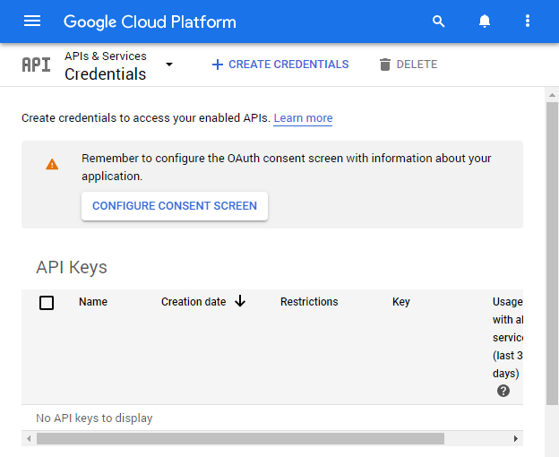
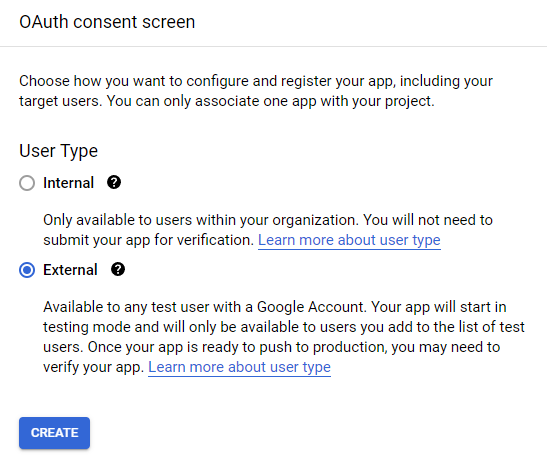
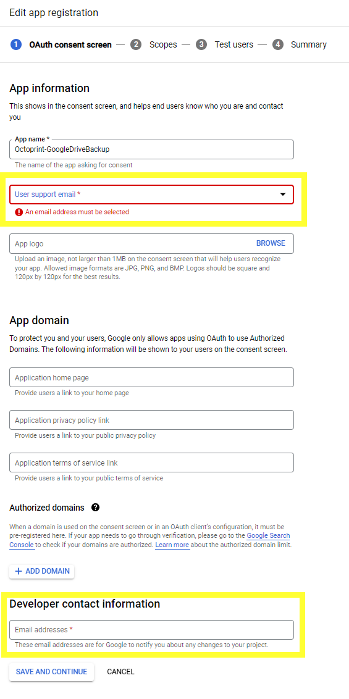
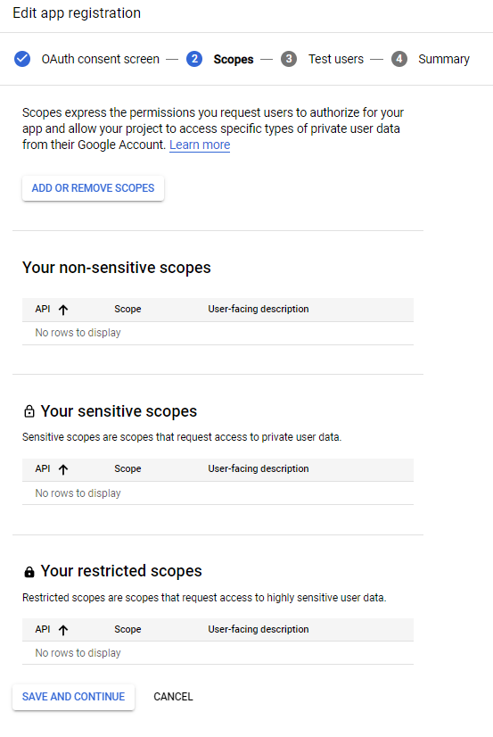
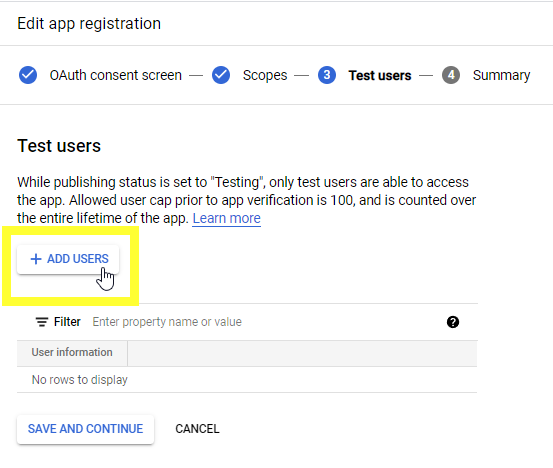
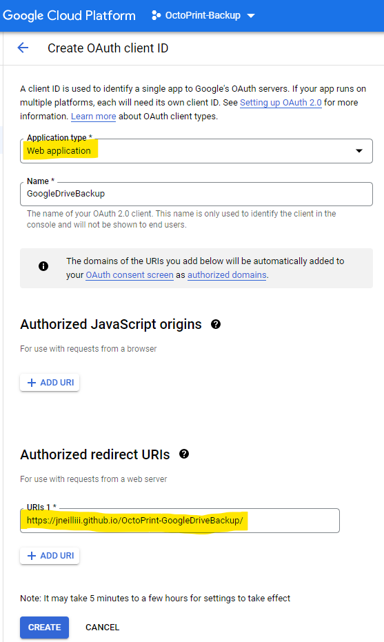
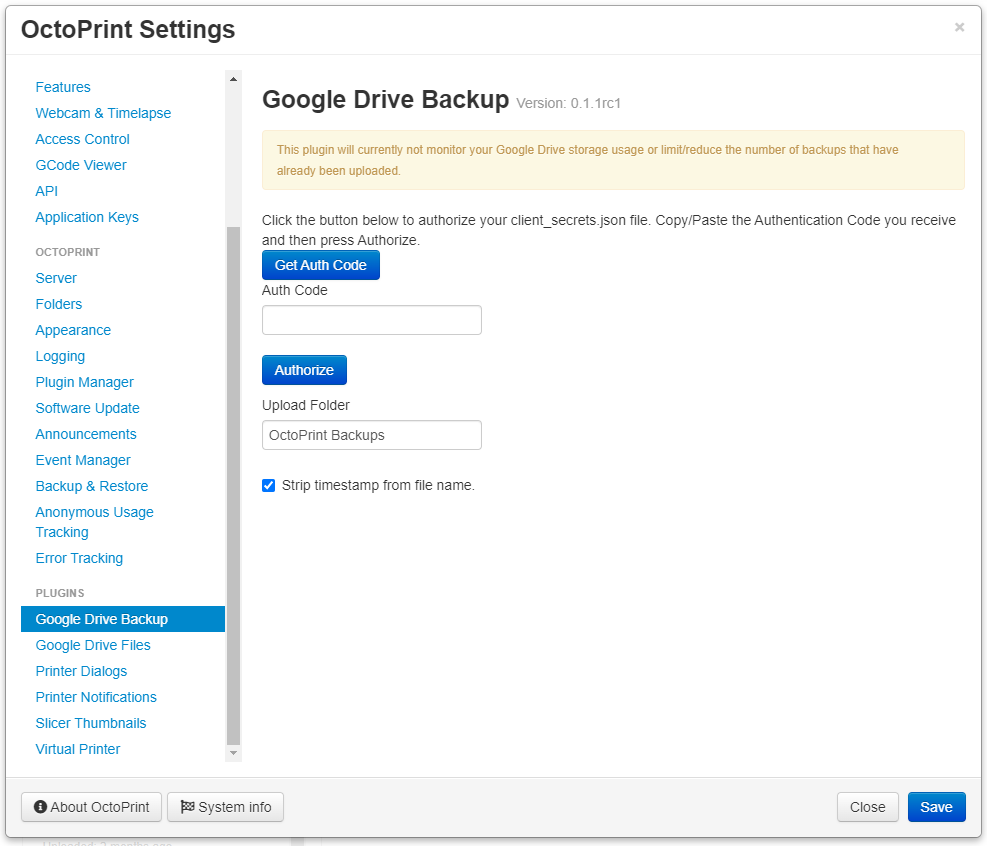
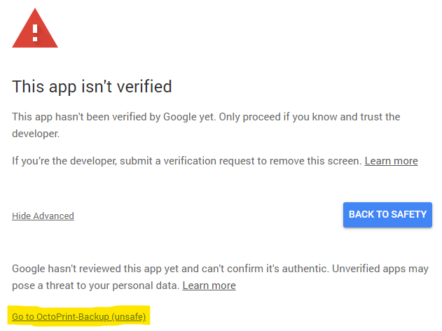

# Google Drive Backup

This plugin will automatically upload a backup upon completion to your authorized Google Drive. In order for the plugin to work properly you will have to create a Google OAuth App to authorize access. To create your own Google OAuth app please follow the directions outlined in the Prerequisites section below.

## Prerequisites

### OctoPrint 1.5.0
If you are using a version of OctoPrint older than version 1.5.0 this plugin will not work.

### Create a Google OAuth App
1.	Login to the [Google Developers Console](https://cloud.google.com/console)  

2.	Create a new project giving it a name of your choice.  

3.	In the sidebar on the left (via ), select **APIs and Services** > **Dashboard** then at the top of the page click the button to `Enable APIS and Services`.  

4.	Enter drive in the search box at the top of the page and click `Google Drive API`.  

5.	Click the `Enable` button to allow our app to use the Google Drive API.  

6.	In the sidebar on the left, select **APIS and Services** > **Credentials**  

7.	Click `CONFIGURE CONSENT SCREEN` button at the top of the page.  

8.	Select the `External` user type if you do not use Google G Suite, otherwise you can select `Internal` and click `Create`.  

9.	Click `Save and Continue` on the remaining pages for your consent screen, and then click `Back to Dashboard`.  

10.	In the sidebar on the left (via ), select **APIs and Services** > **Credentials** again.  

11.	Click on `Create credentials` and select `OAuth client ID`.  

12.	Select `Desktop App` for application type and then enter a name (can be anything and does not really matter) and then click `Create`.  

13.	Click `OK` to the confirmation page and then use the download button  to save your client_secrets#####.json file.  

14.	Use the downloaded client_secrets#####.json file to upload into the plugin’s settings to authorize its access to your Google Drive as described in the Configuration section below.

## Setup

Install via the bundled [Plugin Manager](https://docs.octoprint.org/en/master/bundledplugins/pluginmanager.html)
or manually using this URL:

    https://github.com/jneilliii/OctoPrint-GoogleDriveBackup/archive/master.zip

## Configuration
Once the Prerequisite steps above have been completed and you have downloaded your client_secrets.json file follow these steps to authorize the plugin to your newly created app.

1. Open OctoPrint's settings from the System menu at the top of the page and select `Google Drive Backup` in the left-hand navigation menu.  

2. Use the `Browse` button to select your downloaded client_secrets#####.json file and press the `Upload` button.  

3. An authentication URL will be generated and presented to you. Click that new URL to open a new window and authorize your custom Google app.  

4. Log in to your Google account you want to give Drive access to. You will get a warning that the App isn't verified. This is normal as you have not submitted your custom app for verification by Google. You can choose to do that if you want but is not necessary for the operation of the plugin. Click the `Advanced` link at the bottom of the page and the click `Go to <app name>`.  

5. Click the `Allow` button to retrieve your authentication code to enter in the plugin's settings in the next step.  

6. Copy the code from step 5 and paste it into the **Auth Code** field and click `Authorize`.  

7. If everything went well then you will be presented with a successful message.  

## To-Do

- [X] ~~Improve documentation.~~
- [ ] Add route hook to allow for local redirect URIs during authentication.
- [ ] Delete certs instead of just clearing flags to start over.
- [ ] Improve error handling, display messages in UI.

## Get Help

If you experience issues with this plugin or need assistance please use the issue tracker by clicking issues above.

## Additional Plugins

Check out my other plugins [here](https://plugins.octoprint.org/by_author/#jneilliii)

## Sponsors
- Andreas Lindermayr
- [@Mearman](https://github.com/Mearman)
- [@TxBillbr](https://github.com/TxBillbr)
- Gerald Dachs
- [@TheTuxKeeper](https://github.com/thetuxkeeper)
- @tideline3d
- [SimplyPrint](https://simplyprint.dk/)
- [Andrew Beeman](https://github.com/Kiendeleo)
- [Calanish](https://github.com/calanish)

## Support My Efforts
I, jneilliii, programmed this plugin for fun and do my best effort to support those that have issues with it, please return the favor and leave me a tip or become a Patron if you find this plugin helpful and want me to continue future development.

 

<small>No paypal.me? Send funds via PayPal to jneilliii&#64;gmail&#46;com

You can use [this](https://www.paypal.com/cgi-bin/webscr?cmd=_xclick&business=jneilliii@gmail.com) link too. But the normal PayPal fee will be deducted.
</small>

