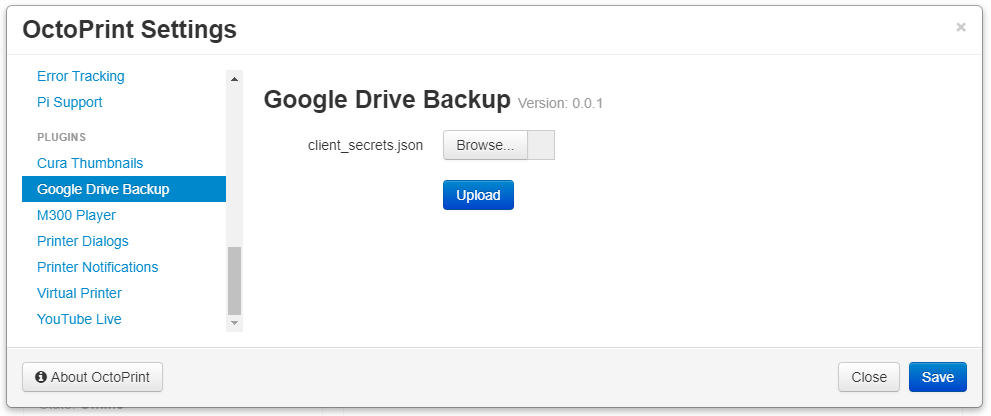
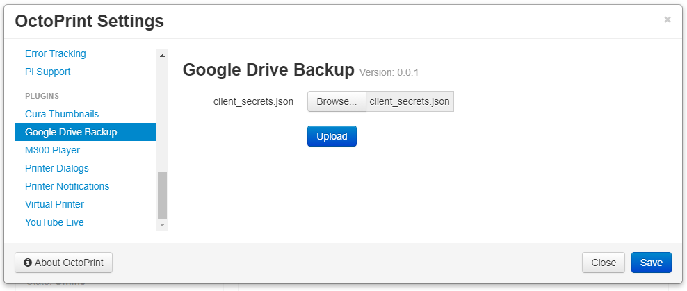
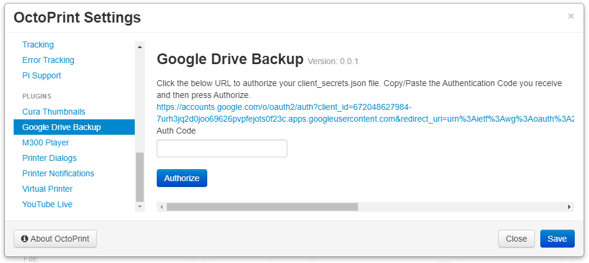
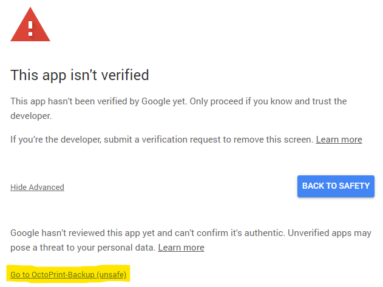
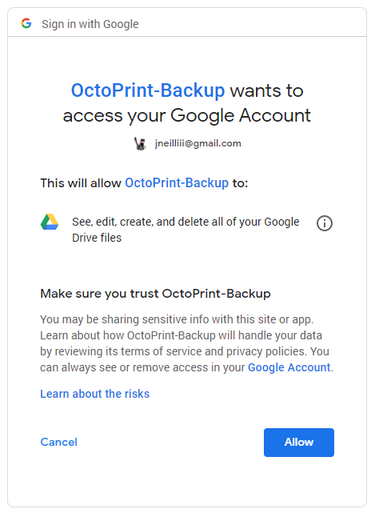
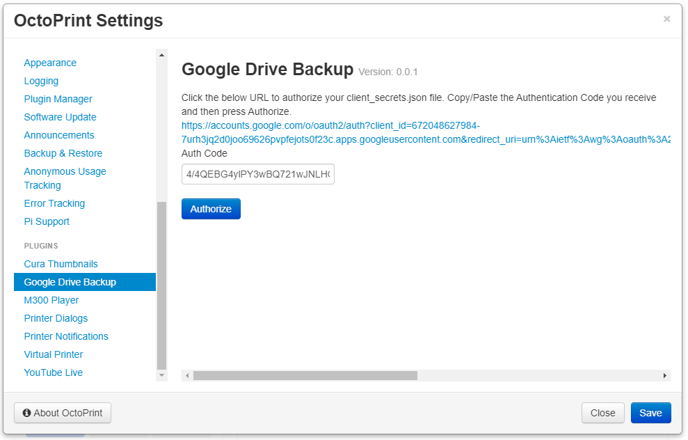
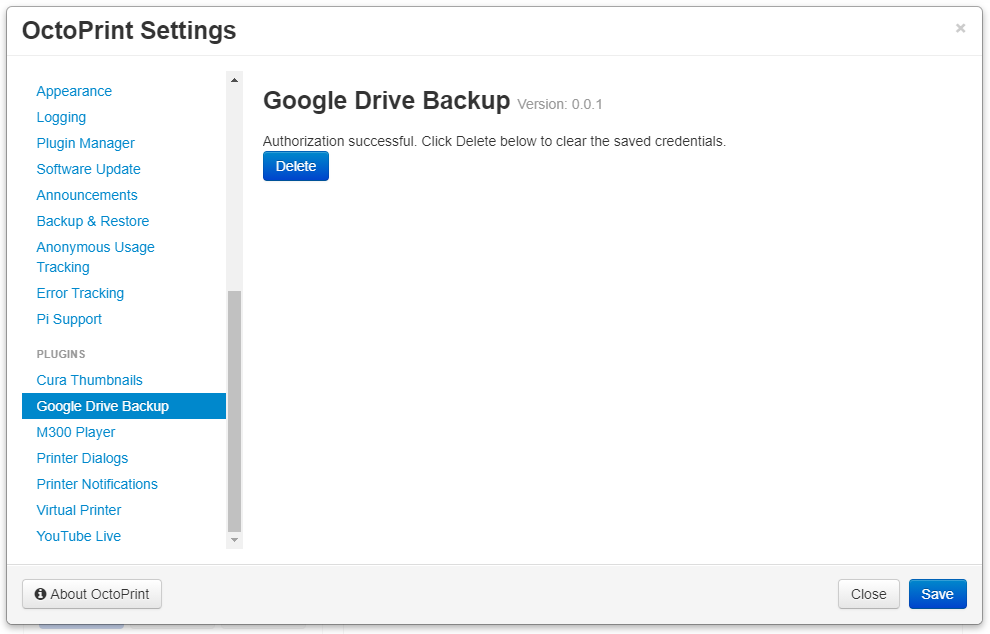

# Configuration

Once the [Prerequisite](./) steps have been completed and you have downloaded your client\_secrets.json file follow these steps to authorize the plugin to your newly created app.

1. Open OctoPrint's settings from the System menu at the top of the page and select `Google Drive Backup` in the left-hand navigation menu.   

   

2. Use the `Browse` button to select your downloaded client\_secrets\#\#\#\#\#.json file and press the `Upload` button.   

   

3. An authentication URL will be generated and presented to you. Click that new URL to open a new window and authorize your custom Google app.   

   

4. Log in to your Google account you want to give Drive access to. You will get a warning that the App isn't verified. This is normal as you have not submitted your custom app for verification by Google. You can choose to do that if you want but is not necessary for the operation of the plugin. Click the `Advanced` link at the bottom of the page and the click `Go to <app name>`.   

   

5. Click the `Allow` button to retrieve your authentication code to enter in the plugin's settings in the next step.   

   

6. Copy the code from step 5 and paste it into the **Auth Code** field and click `Authorize`.   

   

7. If everything went well then you will be presented with a successful message.   

   

