# Create a Google OAuth App

1. Login to the [Google Developers Console](https://cloud.google.com/console)   

   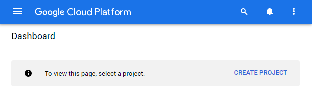

2. Create a new project giving it a name of your choice.   

   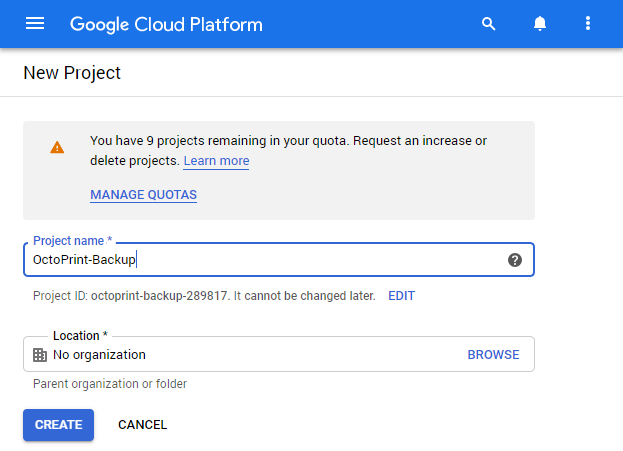

3. In the sidebar on the left \(via \), select **APIs and Services** &gt; **Dashboard** then at the top of the page click the button to `Enable APIS and Services`.   

   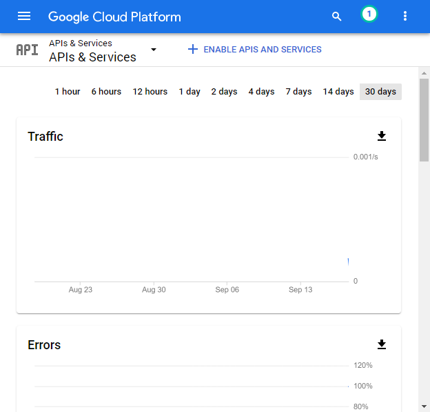

4. Enter drive in the search box at the top of the page and click `Google Drive API`.   

   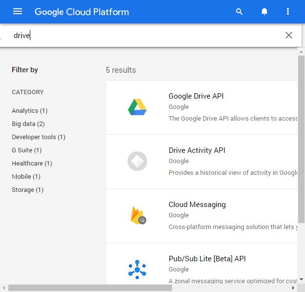

5. Click the `Enable` button to allow our app to use the Google Drive API.   

   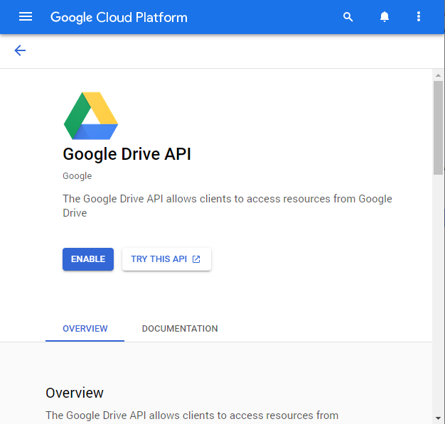

6. In the sidebar on the left, select **APIS and Services** &gt; **Credentials**   

   

7. Click `CONFIGURE CONSENT SCREEN` button at the top of the page.   

   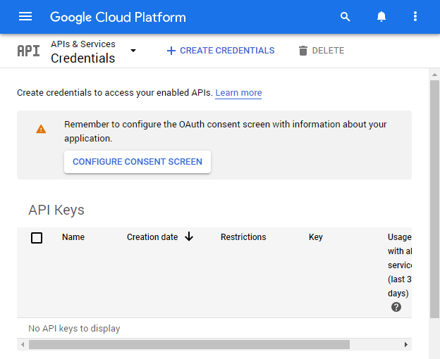

8. Select the `External` user type if you do not use Google G Suite, otherwise you can select `Internal` and click `Create`.   

   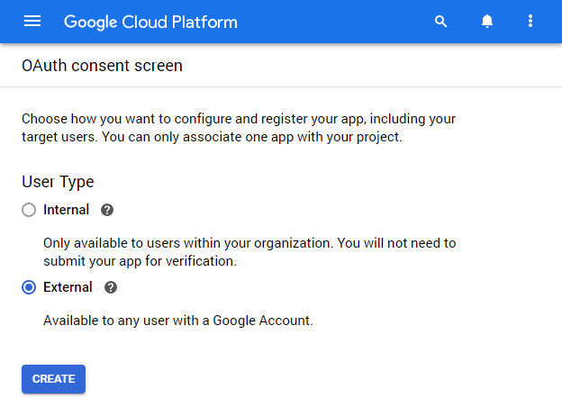

9. If you don't publish your app you need to add the user email that you will be using to access Google Drive as a Test User.   

   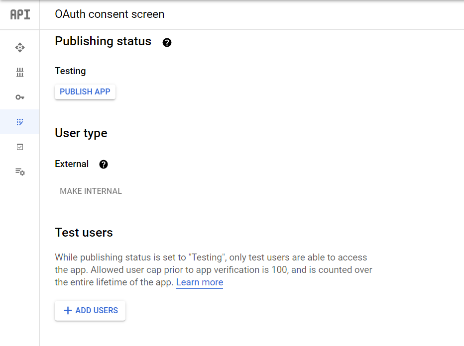

10. Click `Save and Continue` on the remaining pages for your consent screen, and then click `Back to Dashboard`.   

    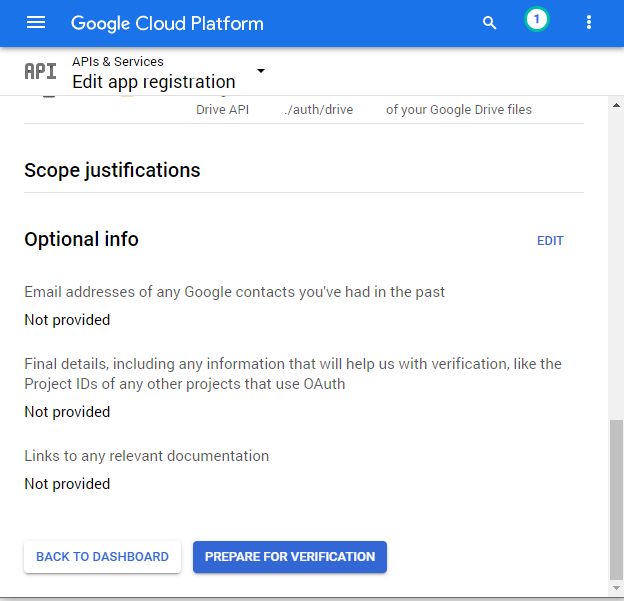

11. In the sidebar on the left \(via \), select **APIs and Services** &gt; **Credentials** again.   

    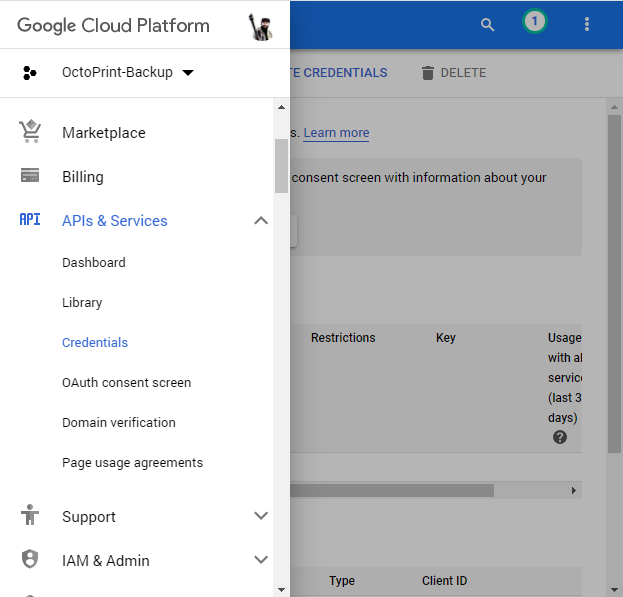

12. Click on `Create credentials` and select `OAuth client ID`.   

    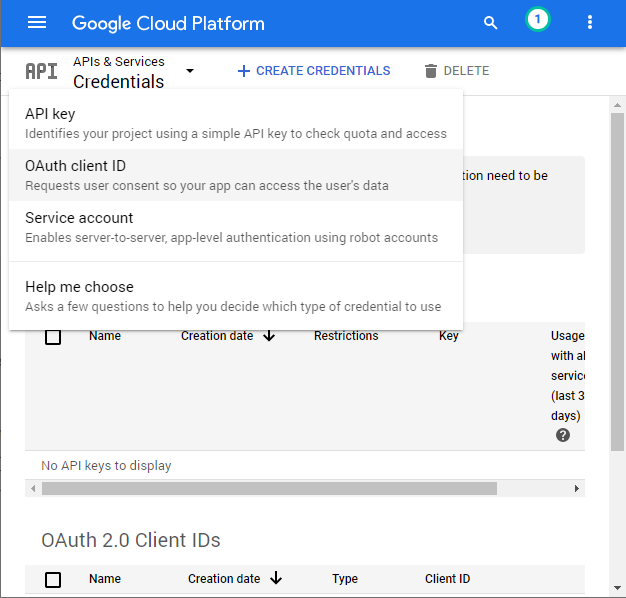

13. Select `Desktop App` for application type and then enter a name \(can be anything and does not really matter\) and then click `Create`.   

    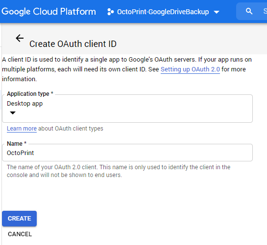

14. Click `OK` to the confirmation page and then use the download button  to save your client\_secrets\#\#\#\#\#.json file.   

    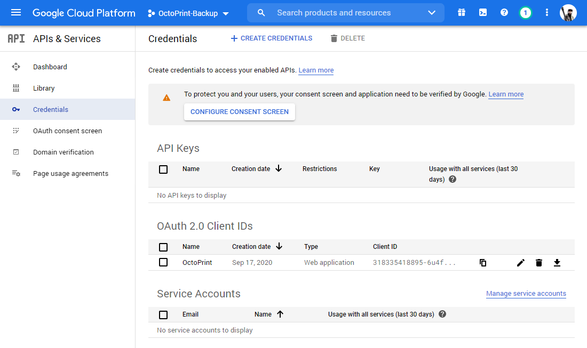

15. Use the downloaded client\_secrets\#\#\#\#\#.json file to upload into the plugin’s settings to authorize its access to your Google Drive as described in the Configuration section below.

